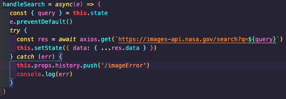

# **Sei-Project-2**

# The Nasa Archives 

Project 2: Multi-page site using NASA's public RESTful API's
This site is pair-coded using NASA's public API's. We used the API's to GET & POST to display varied content to the viewer and ability to search NASA's database.

This was our first time using APIs in an independent project and I really enjoyed looking through what was returned while checking out APIs to inspire ideas for pages on our site.

You can check it out here:
https://nasa-archives.netlify.app/

Or checkout the GitHub repo here to download:
https://github.com/A-Der/sei-project-2

# Code Installation:
- Clone or download the repo
- Install Yarn in terminal with command: yarn
- Start server with terminal command: yarn start

# Brief
- Find and use a RESTful API to build a multi-page site
- Have several components - At least one classical and one functional
- The app can have a router - with several "pages"
- Be deployed online and accessible to the public

# Technologies Used
- Insomnia
- React
- Axios
- Express
- Node
- AJAX
- Bulma
- Sass
- GitHub

# API:
https://api.nasa.gov

# Dev Tools:
- Google Chrome dev tools
- GitHub
- Git
- Insomnia
- Yarn
- Netlify

# **Our Approach** #

# Initial search through API
We searched for an interesting free API and came across NASA's database. There was a plethora of APIs to choose from; images from various satellites and land rovers and project information amongst many others.

We decided on using a handful of different APIs across our site, however for our MVP we decided on the Home Page, Picture of the Day Page and Projects Page.
The Nasa Albums Page was a 'nice to have' which we successfully completed.

# Picture of the Day
The 'Picture of The Day' is directly from NASA themselves which we dedicated a page to, complete with owners name and a short description of what the photo is displaying.
As our API needed a key to GET our data I hid this in a '.env' file at the root level. Using concatenation I then attached this using 'process.env.REACT_APP_NASA_KEY' where necessary to the URL in the Axios requests.

# Projects
A library containing many of NASA's projects, past and present, was an interesting feature we came upon. However, the data returned in this request only had the date and project ID, which meant having to take that ID and sending a new GET request for that specific project. At first I found this annoying as I thought it would be easier to just have all of them there to go through, but I understood later that such a big request to return a huge amount of data would be very expensive and time consuming. The only really minor issue with it was that I was only able to display the date of the project, rather than a title, when I mapped them out in a list which does not contribute to a good UX. I used one API request to display a small selection (instead of 12500) of projects ordered by date. Upon selecting one of these projects, this sent a separate API request to retrieve data about that specific project and loaded it onto a separate page.

# Nasa Albums
Using NASA's imagery database we created a search page which will take any word(s) as a query and return an array of images that are associated.

 The viewer can also click through the search results which also includes a short description too of each image. We also included a dropdown selection list of popular searches.

 

# Wins
Finding such an interesting API with many ways to GET different collections of images/information was both a win and also a challenge. There were lots of information to look through which was really exciting as so many ideas spring to mind about what could be done with them. 
Although quite simple, the Picture of the Day was my favourite component. I really liked the up to date interactive feel, and even better that it also has the owners name and detailed information about the photo. For me I think this was a awesome API provided by Nasa.

# Challenges
One particular API request was a little more complicated than other APIs. The project search and display. As the initial request for the projects only returned their date and ID, we had to take the ID upon selecting and fire off a new GET request using that ID. This came to light as the better option later on in the development stages. The user-end process is seamless and I am pleased with the outcome.

# Improvements
- I would like to find a more pleasant and user friendly way of displaying the projects on the project page. Only having their date or ID to go by does not give the user much to go by and feels a bit too clinical.
- Searching the image database has two options, to enter a search query or select from a drop down box. I would like to combine these two so that the returned data is filtered by both queries.

# Key Learnings
This was my first project working with another and it was a great feeling to be able to bounce off of one another in all areas of the project. Most notably:
- Pooling ideas in the initial stages and mixing together our ideas.
- Dividing the workload while maintaining harmony between our pieces of work with open, technical communication.
- Using each other to see any blind spots we may have missed especially when we encountered a problem.
